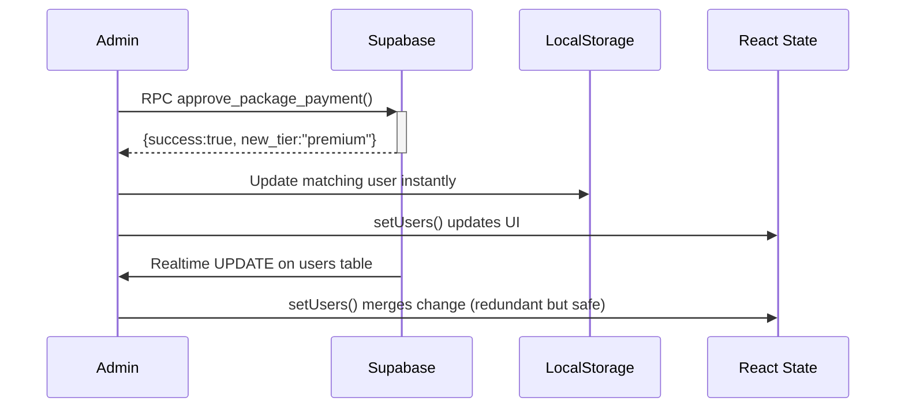

# Package Approval System — Backend Workflow Implementation

## 🎯 Objective
Implement a robust backend workflow that updates a user's `package_tier` upon admin approval of a package payment, with full transaction integrity, atomic error handling, and a complete audit trail.

---

## 📦 Components Created

| File | Purpose |
|---|---|
| `FINAL_APPROVAL_WORKFLOW.sql` | Database schema updates + stored procedures |
| `src/pages/Admin.jsx` | Admin UI with RPC calls and real-time subscriptions |
| `src/hooks/usePackageApproval.js` | React utilities for realtime sync & audit logs |
| `FINAL_APPROVAL_WORKFLOW.sql` | Transactional `approve_package_payment` function |
| `DIAGNOSTIC_GUIDE.md` | Troubleshooting steps for data refresh issues |
| `IMPLEMENTATION_GUIDE.md` | Full deployment & usage documentation |

---

## 🏗️ Database Architecture

### Tables Involved
```
upgrade_requests (status: pending → approved)
users             (package_tier updated)
user_packages     (new subscription record created)
audit_logs        (immutable record of change)
notifications     (user notified via trigger)
```

### Core Stored Procedure: `approve_package_payment(request_id, approver_id, notes)`

**Operations (atomic transaction):**
1. Lock upgrade request (prevents concurrent approvals)
2. Validate request & user exist
3. Update `upgrade_requests.status = 'approved'`
4. Update `users.package_tier`, `payment_status`
5. Deactivate old `user_packages`; insert new active record
6. Insert two **audit log** entries (tier change + request approval)
7. Notification inserted via separate trigger

Any failure → whole transaction rolls back.

### Audit Log Format
```json
{
  "table_name": "users",
  "record_id": "user_abc123",
  "action": "UPDATE",
  "field_name": "package_tier",
  "old_value": {"package_tier": "free"},
  "new_value": {"package_tier": "premium", "payment_status": "confirmed"},
  "changed_by": "admin_456",
  "reason": "Upgrade approved via request #123"
}
```

---

## 🔄 Real-Time Updates

**Problem**: Package status remained stuck after refresh.

**Solution**:
- **WebSocket channels** on `users` and `upgrade_requests` tables
- Admin UI subscribes on login → receives push updates instantly
- No manual refresh required
- Cross-tab sync: Change in Tab A appears in Tab B automatically

**Channels**:
- `admin-users-{adminId}` → listens for user row updates
- `admin-upgrades-{adminId}` → listens for upgrade request changes

---

## ⚡ Immediate UI Feedback Flow



Result: UI reflects change immediately, even before round-trip completes.

---

## 🛡️ Error Handling Strategy

### Database Level
- `BEGIN ... EXCEPTION ... ROLLBACK` ensures atomicity
- Specific checks: request exists, status pending, user exists, package active
- Errors logged to `audit_logs` with `action='ERROR'`

### Frontend Level
- RPC errors classified by `error.code` (SQLSTATE)
- User-friendly alerts for each error class
- Retry via Refresh button
- Loading state disables buttons preventing double-submit

---

## 🔐 Security

### RPC Permissions
```sql
GRANT EXECUTE ON FUNCTION approve_package_payment TO authenticated;   -- preferred
-- OR, if using anon key with frontend auth (less secure):
GRANT EXECUTE ON FUNCTION approve_package_payment TO anon;
```

### RLS Policies
- `audit_logs`: Admins can read; INSERT restricted to admin role
- `upgrade_requests`: Admin manage all; users read own
- `users`: Default RLS; ensure admin policies exist (see `packages_database.sql`)

### Data Integrity
- `user_packages` unique index on `(user_id, is_active)` prevents duplicate active subscriptions
- Foreign keys with `ON DELETE CASCADE` prevent orphaned records

---

## 🧪 Testing Guide

### Test Case 1: Happy Path
```sql
-- Insert test request
INSERT INTO upgrade_requests (
    user_id, user_email, from_package_tier, 
    to_package_tier, to_package_id, amount_paid, status
) VALUES (
    'test123', 'test@example.com', 'free', 'premium', 
    (SELECT id FROM packages WHERE tier='premium'), 10.00, 'pending'
);

-- Approve via RPC
SELECT approve_package_payment(LASTVAL(), 'admin_123', 'Test payment');

-- Verify
SELECT package_tier, payment_status FROM users WHERE id='test123';
-- Expected: premium, confirmed

SELECT * FROM user_packages WHERE user_id='test123' AND is_active=true;
-- Expected: one active row with package_tier='premium'
```

### Test Case 2: Concurrency Protection
- Open two admin tabs
- Approve same request simultaneously
- One succeeds; other receives `ALREADY_PROCESSED` error

### Test Case 3: Real-Time Propagation
1. Admin A approves request
2. Admin B (different tab) should see:
   - `upgrade_requests` list update immediately
   - `users` list update immediately
   - No manual refresh needed

### Test Case 4: Audit Trail
```sql
SELECT action, old_value->>'package_tier' AS old, 
       new_value->>'package_tier' AS new, 
       changed_by, reason, created_at
FROM audit_logs
WHERE record_id = 'test123' AND table_name='users'
ORDER BY created_at DESC;
```

---

## 📊 Monitoring Queries

### Pending Upgrades
```sql
SELECT COUNT(*) FROM upgrade_requests WHERE status='pending';
```

### Approvals Per Day
```sql
SELECT DATE(created_at) AS day, COUNT(*) AS approvals
FROM audit_logs
WHERE action='APPROVE' AND table_name='upgrade_requests'
GROUP BY DATE(created_at) ORDER BY day DESC LIMIT 7;
```

### Failed RPC Calls
```sql
SELECT * FROM audit_logs 
WHERE action='ERROR' 
ORDER BY created_at DESC LIMIT 10;
```

---

## 🚀 Deployment Steps

1. **Run SQL Migration**
   - Open Supabase Dashboard → SQL Editor
   - Paste `FINAL_APPROVAL_WORKFLOW.sql`
   - Execute (may require `service_role` or superuser for SECURITY DEFINER)
   - Grant execute permissions if using anon key (see comments in SQL)

2. **Update Frontend**
   - Replace `approveUpgradeRequest` and `rejectUpgradeRequest` in `Admin.jsx` with provided code
   - The file has already been patched in this project

3. **Clear Old Cache**
   ```javascript
   // In admin console once:
   localStorage.removeItem('birthdayUsers');
   localStorage.removeItem('pending_upgrades');
   ```

4. **Verify Setup**
   ```bash
   # Check realtime is enabled in Supabase:
   # Dashboard → Database → Replication → confirm "Realtime" enabled
   ```

---

## 📋 Files Modified

### `src/pages/Admin.jsx`
- Replaced direct `UPDATE` with RPC call
- Added immediate localStorage sync
- Added real-time subscriptions on `users` table
- Unified user loading to combine Supabase + orders
- Added `handleApprovalError` with categorized messages
- Button disabling during processing

### New Files
- `FINAL_APPROVAL_WORKFLOW.sql` — Backend logic
- `src/hooks/usePackageApproval.js` — React utilities
- `DIAGNOSTIC_GUIDE.md` — Troubleshooting manual
- `IMPLEMENTATION_GUIDE.md` — Full docs

---

## 🔄 Data Flow Diagram

```
Admin Clicks "Approve"
        │
        ▼
   RPC Call
        │
        ▼
   PostgreSQL Transaction (atomic)
   ├─ UPDATE upgrade_requests → status='approved'
   ├─ UPDATE users → package_tier, payment_status
   ├─ INSERT INTO user_packages → new subscription
   ├─ INSERT INTO audit_logs (×2)
   └─ COMMIT
        │
        ▼
   Response { success: true, new_tier: "premium" }
        │
   ├────┴─────┐
   ▼          ▼
Realtime     LocalStorage
Push         Immediate
│            │
▼            ▼
Admin B      Other admin tabs
sees update  sees update (via real-time)
```

---

## 🐛 Known Issues & Workarounds

| Issue | Cause | Workaround |
|-------|--------|------------|
| Approval fails with "permission denied" | RPC not granted to role | Run GRANT EXECUTE statements |
| Real-time messages delayed | Browser WebSocket blocked | Ensure WSS connection; try different network |
| Duplicate notifications | Two triggers fire | Only one notification trigger needed; the extra audit trigger is fine |
| Old data after refresh | localStorage overrides Supabase | Call `loadUsersFromSupabase()` after login |

---

## 📈 Future Enhancements

- **Webhook alerts** to Slack/Telegram on approvals
- **Expiry automation** via `cleanup_expired_packages()` cron
- **Refunds workflow** with proration calculations
- **User-facing notification center** in Dashboard
- **Export audit logs** to CSV/Excel

---

## 💡 Quick Reference

### Approve a Request
```javascript
const { data } = await supabase.rpc('approve_package_payment', {
    p_request_id: 123,
    p_approved_by: 'admin_abc',
    p_notes: 'Payment verified via MoMo'
});
```

### Get User's Package History
```sql
SELECT * FROM get_user_package_history('user_abc');
```

### Manually Sync a User
```javascript
const { data } = await supabase.rpc('sync_user_package_tier', {
    p_user_id: 'user_abc'
});
```

---

*© 2026 Birthday App — Powered by Supabase & React*
